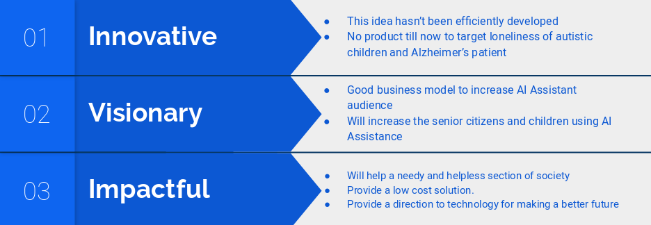
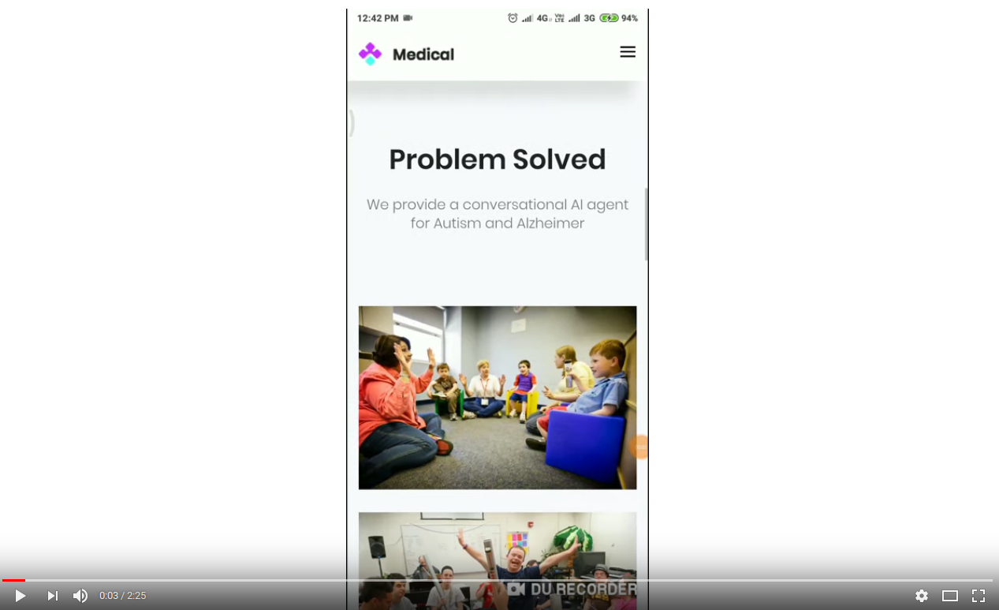

> **Enhancing lives today and accelerating a spectrum of solutions for tomorrow**

Undoubtedly, Alzheimer and Autism are problems of concern in today’s world. Moreover, hidden fear makes autistic people more expressive to a robot than to human beings.

We provide a companion for these peeople. It helps them to improve there conditino and come more closer to their loved ones. 

## 1. Problem Solved ##

1. Autism
2. Alzheimer

### 1.1 Autism ###

> If you’ve met one person with autism, you’ve met one person with autism,” [**-Dr. Stephen Shore**](http://the-art-of-autism.com/dr-stephen-shore-the-importance-of-art-and-music/)

Autism is a lifelong developmental disability that affects how people perceive the world and interact with others. Autistic people see, hear and feel the world differently to other  people. If you are autistic, you are autistic for life; autism is not an  illness or disease and cannot be cured. Often people feel being autistic is a fundamental aspect of their identity.

Autism is a spectrum condition. All autistic people share certain  difficulties, but being autistic will affect them in different ways.  Some autistic people also have  learning disabilities, mental health issues or other conditions,  meaning people need different levels of support. All people on the  autism spectrum learn and develop. With the right sort of support, all  can be helped to live a more fulfilling life of their own choosing.

#### 1.1.1 How ####

Things that we have tried to replicate the [ABA](https://www.autismspeaks.org/applied-behavior-analysis-aba-0) therapy :

1. Asking about their interest e.g. cartoons, food etc. ( What and Who question ??)
2. Asks simple question about things used in daily life.
3. Update them with daily news so that they feel connected to real world.
4. Give them real world scenario, that helps to improve their judgement and also helps to improve their shy behaviour.
5. Simple Maths problem, to improve their quantivative skills
6. Teach them humans reaction ( Angry, sad, happy, surprised etc) and check their skill in different real world scenarios.

### 1.2 Alzheimer ###

> You can't converse with Alzheimer's sufferers in the way you do with others; the dialogue tends to go round in circles.  **-Kevin Whately**   

A progressive disease that destroys memory and other important mental functions. Alzheimer's is a type of dementia that causes problems with memory,  thinking and behavior. Symptoms usually develop slowly and get worse  over time, becoming severe enough to interfere with daily tasks. The most common early symptom of Alzheimer's is difficulty remembering newly learned information.

Just like the rest of our bodies, our brains change as we age. Most of us eventually notice some slowed thinking and occasional problems with remembering certain things. However, serious memory loss, confusion and other major changes in the way our minds work may be a sign that brain cells are failing.

#### 1.2.1 How ####

Things that we have tried to replicate the therapy :

1. Start by asking them simple daily routine question like *Did you bath ?* etc., this will help them to do their routine work, if they have forgotten about that.
2. Try to remind them about their most memorable experience collected from their loved ones. 
3. Show them pictures of their family members reguraly, this makes them to connect themself agian with their famalies, which they have foregotten.
4. Ask them about their past like college, school, best friend, birthdates, etc.
5. Show them latest news to make them updated with the latest world. 
6. Give them real world scenario, that helps to improve their judgement .
7. Test their judgement and thinking capabilties using some simple test and riddles.

## 2. Benifits ##

## 3. Technology Used ##

1. Microsoft Azure ( Free Student'scredit worth $100 )
2. Azure Bot Framework
3. Bing Image Search API
4. News API
5. Github 

## 4. Future Improvement ##

In this prototype most of the things are hard-coded. We can extend this project by including data driven processes. Also the conversation mst be user specific, for that we require data about the person's history, interest, medical condition etc. Also many more use case can be integrated in game mode. 

## 5. Website ## 

## 6. Demo (Autism) ##

## 7. Author ##

[Vedic Partap](http://cse.iitkgp.ac.in/~vedicp/)

Computer Science and Engineering, IIT Kharagpur 

**Team Anon_** : Hackference 2k18 submission 

**Theme** : Open Innovation 

